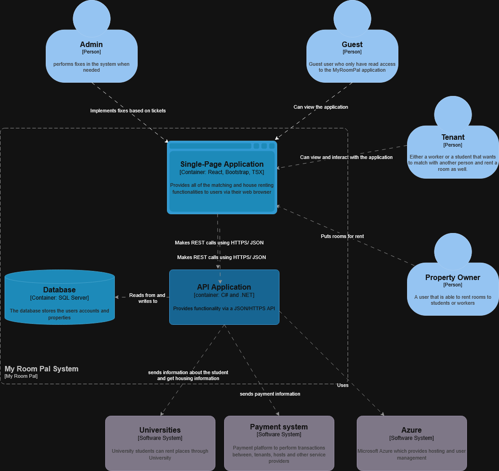
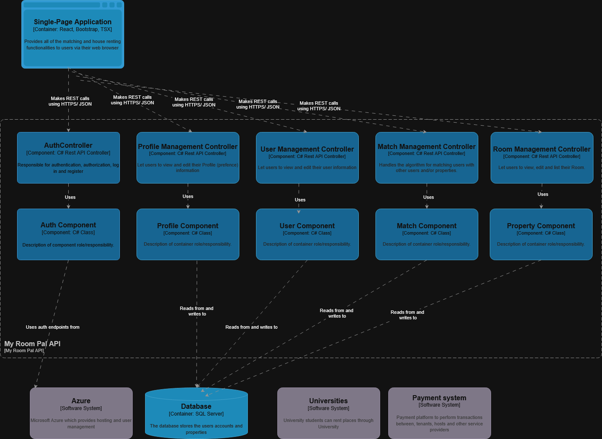
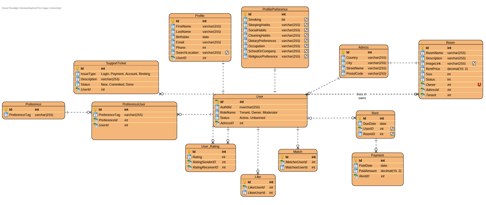

# MyRoomPal — Full‑Stack Matching Platform

## Problem & goal
Students and workers increasingly move across cities/countries for study and career opportunities. Finding a compatible living environment (and roommates) is often time-consuming and has a high failure rate.

**MyRoomPal** addresses this by providing a user-friendly platform that **matches individuals based on interests, habits, lifestyle, and financial situation**.

> This repository is maintained as a portfolio artifact. It may not be directly runnable today (e.g., expired credentials and removed cloud resources).

---

## What I built / contributed
This project demonstrates end-to-end delivery across **frontend, backend, data modeling, architecture, and cloud infrastructure**:

- **Matching experience (core product feature)**
  - Implemented the matching page/flow to help users find compatible roommates.
  - Worked across UI + API design to support matching interactions.

- **Frontend**
  - Built with **React + TypeScript** (see [`myroompal-fe/`](myroompal-fe/)).
  - Implemented UI and design work.

- **Backend**
  - Built with **ASP.NET Core Web API** (see [`myroompal-be/`](myroompal-be/)).
  - Implemented business logic and API endpoints to support application workflows.

- **Database & data modeling**
  - Created the **ERD in Visual Paradigm** to design and communicate the relational model.
  - Implemented the model using **Entity Framework Core (EF Core)** (entities, relationships, migrations).
  - Backed by **Microsoft SQL Server (MSSQL)**.

- **Cloud & DevOps**
  - Set up **Infrastructure-as-Code (IaC)** using **Azure Verified Modules (Bicep)**.
  - Helped build a pipeline capable of deploying to **multiple environments**.
  - Set up **Azure Key Vault** to store and manage secrets securely.

- **Architecture documentation**
  - Produced **C4 models** up to level 3:
    - System Context
    - Container
    - Component

- **Testing**
  - Wrote **unit tests** for business logic and components where feasible.
  - Wrote **integration tests** to validate critical API flows end-to-end.
  - Due to time constraints, overall test coverage is **partial** (documented below as a future improvement).

---

## Tech stack
- **Frontend:** React + TypeScript, Bootstrap
- **Backend:** ASP.NET Core Web API (C#)
- **Data access:** Entity Framework Core (EF Core)
- **Database:** Microsoft SQL Server (MSSQL)
- **Infrastructure:** Bicep (Azure Verified Modules)
- **Secrets:** Azure Key Vault
- **CI/CD:** Azure DevOps pipelines (exported into this repo)

---

## CI/CD note (Azure DevOps origin)
This project was originally developed and built in **Azure DevOps**.  
It was later **re-uploaded to GitHub** as a portfolio repository.

---

## Architectural approach
### Modular monolith (intentional choice)
Due to time and budget constraints, we chose a **monolith**—but designed it as a **modular monolith** to preserve separation of concerns and enable future evolution.

What this demonstrates:
- Ability to make pragmatic trade-offs under constraints
- Focus on maintainability via modular boundaries
- A foundation that could later split into services if needed

---

## Diagrams
This project includes architecture and data-model documentation to explain the system at a glance.

### C4 model
- **Level 1 — System Context:** [`docs/diagrams/c4/context.png`](docs/diagrams/c4/context.png)
- **Level 2 — Container:** [`docs/diagrams/c4/container.png`](docs/diagrams/c4/container.png)
- **Level 3 — Component:** [`docs/diagrams/c4/component.png`](docs/diagrams/c4/component.png)

## Context layer

## Container layer

## Component layer

### Data model (ERD)
The ERD below was **designed in Visual Paradigm** and then implemented in the application using **EF Core**.

- **ERD:** [`docs/diagrams/erd/erd.png`](docs/diagrams/erd/erd.png)

---

## Where to look (for reviewers)
If you are reviewing this repository for code quality and engineering approach, the most relevant areas are:

- **Frontend (React + TS):** [`myroompal-fe/`](myroompal-fe/)  
  UI structure, type safety, API integration patterns, styling approach.

- **Backend (ASP.NET Core):** [`myroompal-be/myroompal-api/Modules`](myroompal-be/myroompal-api/Modules)  
  Endpoint design, layering/modularity, validation/error handling patterns.

- **Data model (EF Core):** typically under [`myroompal-be/myroompal-api`](myroompal-be/myroompal-api)  
  Entities, Data and migrations.

- **Tests:** typically alongside the backend and/or in dedicated test projects under [`myroompal-be/MyRoomPal.Tests`](myroompal-be/MyRoomPal.Tests)  
  Unit + integration tests (partial coverage due to time constraints).

- **Database documentation:** see Diagrams for the ERD (Visual Paradigm).

- **IaC (Bicep/AVM):** look for `infra/` folder  
  AVM modules, parameterization, environment separation.

- **Pipelines (Azure DevOps):** Look for `pipelines/` folder  
  Multi-environment deployment logic and Key Vault integration.

---

## Engineering highlights (what I’m showcasing)
- Full-stack features
- Type-safe React + TS implementation practices
- ASP.NET Core API development and modular structuring
- Relational data modeling: ERD design (Visual Paradigm) → implementation (EF Core)
- Infrastructure-as-Code using Azure Verified Modules (Bicep)
- Secure secret management with Key Vault
- Architecture communication using C4 (up to component level)
- CI/CD experience via Azure DevOps
